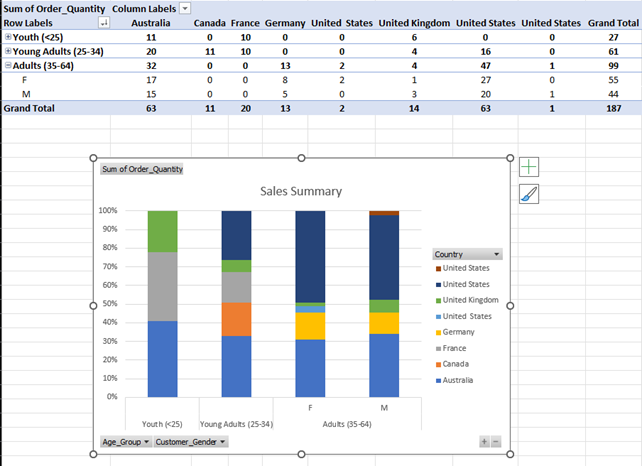
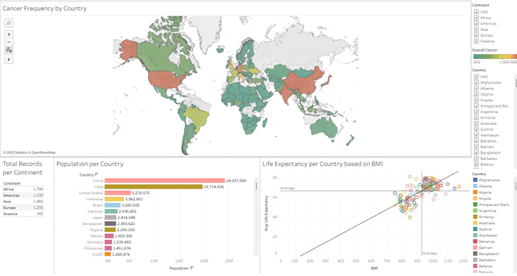
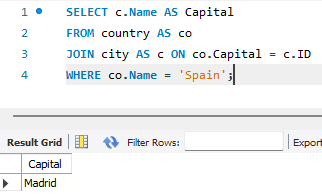
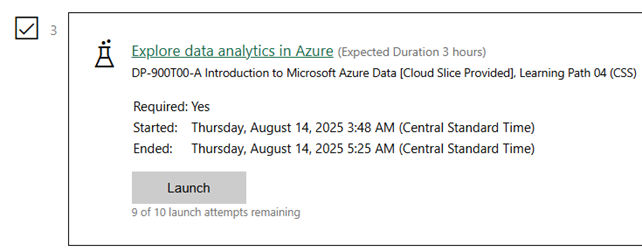
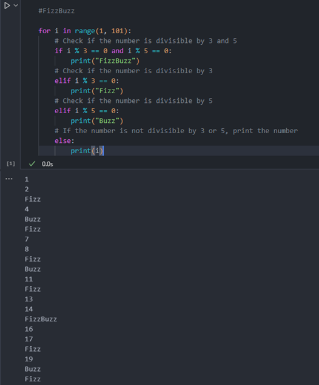
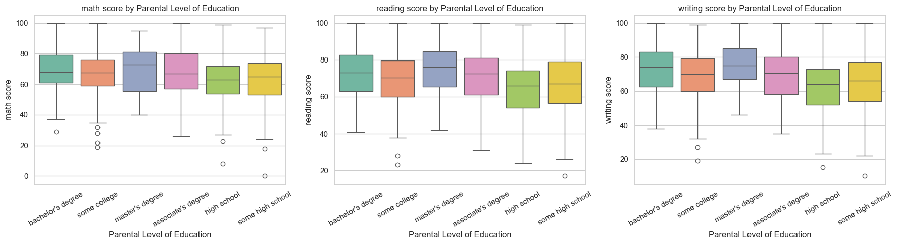

# JustIT Data Technician Workbooks

This repository contains my weekly workbooks and project work from the JustIT Data Technician course. Each week focused on a different area of data analysis and technology, building practical skills through hands-on exercises and projects.

---

## Week 1: Excel Fundamentals

**Workbook:** `Week 1 - Excel/Lee_Nock_Data_Workbook_Week_1.docx`

- Data cleaning and formatting
- Formulas, functions, and pivot tables
- Data visualization with charts

---

## Week 2: Tableau for Data Visualization

**Workbook:** `Week 2 - Tableau/Lee_Nock_Workbook_Week_2.docx`

- Introduction to Tableau interface
- Building interactive dashboards
- Connecting to data sources and creating visual insights

---

## Week 3: SQL & Databases

**Workbook:** `Week 3 - SQL & Databases/Data_Technician_Workbook_Week_3.docx`

- Writing SQL queries (SELECT, JOIN, GROUP BY)
- Database design basics
- Extracting and analyzing data from relational databases

---

## Week 4: Azure & Cloud

**Workbook:** `Week 4 - Azure & Cloud/Lee_Nock_Workbook_Week_5.docx`

- Introduction to cloud computing
- Using Microsoft Azure for data storage and analysis
- Deploying and managing cloud resources
- Used Skillable to immerse myself in Azure

---

## Week 5: Python for Data Analysis

**Workbook:** `Week 5 - Python/Data_Technician_Workbook_Week_6.docx`

- Python programming basics
- Data analysis with pandas and numpy
- Data visualization with matplotlib

---

## Week 6: Project Work

**Notes:** `Week 6 - Project Work/Note.txt`

- Capstone project applying all skills learned
- Real-world data analysis and reporting
- Documentation and presentation of findings

---

## Repository Link

See the live repository at: [GitHub Portfolio](https://github.com/Lee0997/Portfolio-Data-Projects)
